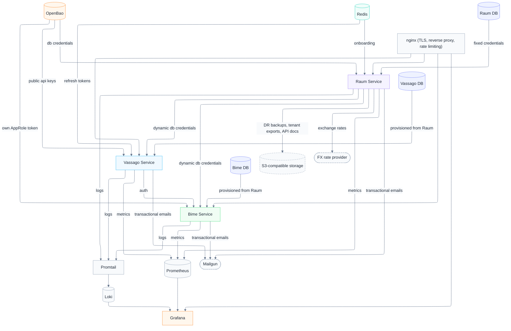

# Kenoma

**Privacy-first B2B SaaS infrastructure.** Kenoma is a reactive, multi-tenant microservices platform providing authentication, organization management, secrets handling, and inventory management as composable backend services.

[](https://github.com/gnosticDeveloper/Kenoma/actions/workflows/ci.yml)
[](https://github.com/gnosticDeveloper/Kenoma/actions/workflows/codeql.yml)
[](LICENSE)
[](pom.xml)

---

## Services

| Service | Port | Description |
|---|---|---|
| **Raum** | `8080` | Organization registry. Manages tenants, registered services, ephemeral database credentials via OpenBao, and billing/invoicing |
| **Vassago** | `8081` | Authentication and identity. JWT issuance, session management, user lifecycle, and password recovery |
| **Bime** | `8082` | Inventory management. Products, variants, metadata, stock ledger, and warehouse locations |
| **Common** | No port | Shared library: DTOs, exception handling, JWT validation, R2DBC connection pooling, the Mailgun email client, and the AppRole self-provisioning client each service uses to set up its own OpenBao policy/role at boot |
| **Frontend** | `5173` (dev) | React/Vite admin UI. EN/ES i18n |

All backend traffic is fronted by **nginx** (config templated from `gateway/nginx.conf.template`), which terminates TLS, applies per-IP rate limiting in front of Vassago's public endpoints, and reverse-proxies `api.<BASE_DOMAIN>` to the three services by path (including `/dr-backups`, `/export-jobs`, and `/migrations`, which route to Raum, and `/roles/vassago`, `/roles/bime`, `/roles/raum`, which each route to that service's own `/roles`), plus `grafana.<BASE_DOMAIN>` to the observability stack.

### Raum: Organization & Credential Registry

Raum is the platform's administrative backbone. It provisions tenant organizations, registers services that consume the platform, and issues ephemeral database credentials through OpenBao AppRole so downstream services never hold long-lived secrets. It also orchestrates new organization onboarding, provisioning the org admin account in Vassago and seeding initial inventory data in Bime according to a configurable preset, with Redis-backed retry so partial failures can be recovered automatically. Raum additionally owns billing (per-module pricing, multi-currency support with a scheduled FX rate refresh, invoice generation and delivery, manual payment-status management), disaster recovery (nightly backups and org/instance-level restore), on-demand per-tenant data export, and schema migrations across every discovered database instance.

**API surface:**

| Method | Path | Description |
|---|---|---|
| `POST` | `/orgs` | Create an organization |
| `GET` | `/orgs` | List organizations |
| `GET` | `/orgs/active-ids` | List ids of active organizations |
| `GET` | `/orgs/{id}` | Get an organization |
| `GET` | `/orgs/{id}/active` | Check whether an organization is active |
| `GET` | `/orgs/{id}/currency` | Get an organization's configured currency |
| `PUT` | `/orgs/{id}` | Update an organization |
| `DELETE` | `/orgs/{id}` | Delete an organization |
| `PUT` | `/orgs/{id}/billing-info` | Update an organization's billing details |
| `POST` | `/orgs/{id}/billing-email` | Set/change the organization's billing email |
| `POST` | `/orgs/{id}/billing-email/confirm` | Confirm a billing email change |
| `POST` | `/orgs/{id}/contact-email/confirm` | Confirm a contact email change |
| `POST` | `/orgs/{id}/export` | Kick off an async per-tenant data export job |
| `GET` | `/orgs/{id}/export/{jobId}` | Poll export job status |
| `GET` | `/orgs/{id}/export/{jobId}/download` | Download the completed export |
| `GET` | `/orgs/{id}/export/{jobId}/download/{index}` | Download one file from a multi-file export |
| `GET` | `/export-jobs` | List export jobs |
| `GET` | `/orgs/{orgId}/billing-history` | List an organization's billing history |
| `GET` | `/orgs/{orgId}/billing-history/{historyId}/invoice` | Download a generated invoice |
| `PUT` | `/orgs/{orgId}/billing-history/{historyId}/payment-status` | Manually set a payment's status |
| `POST` | `/orgs/{orgId}/billing-history/{historyId}/resend` | Resend an invoice email |
| `GET`/`POST` | `/pricing/base` | Get/set base module pricing |
| `GET`/`POST` | `/pricing/modules` | Get/set per-module (service) pricing |
| `GET`/`POST` | `/pricing/exchange-rates` | Get/set exchange rates |
| `GET` | `/pricing/rate` | Get the current exchange rate for a currency pair |
| `POST` | `/services` | Register a service |
| `GET` | `/services` | List all services |
| `GET` | `/services/{id}` | Get a service |
| `PUT` | `/services/{id}` | Update a service |
| `DELETE` | `/services/{id}` | Delete a service |
| `POST` | `/credentials` | Register credentials for a service |
| `POST` | `/credentials/ephemeral` | Issue ephemeral credentials for an org/service pair |
| `POST` | `/onboarding/{orgId}` | Onboard an organization. Seed Vassago admin user and Bime inventory preset |
| `GET` | `/dr-backups` | List available disaster-recovery backups |
| `POST` | `/dr-backups/{id}/restore` | Restore a backup, at instance or org level |
| `POST` | `/migrations/run` | Re-run the Flyway migration sweep across every discovered database |
| `GET` | `/roles` | List Raum's role definitions and their permissions |

**Scheduled jobs:** daily instance-level DR backup (`pg_dump` per database, gzipped, uploaded to S3-compatible storage) plus a separate, offset daily org-level backup, invoice deadline notifications, and periodic FX rate refresh (org-configurable periodic vs. real-time).

**Roles:** `RAUM_ADMIN` (full platform administration), `RAUM_OWNER` (export the org's own data), `RAUM_ONBOARDING` (initiate org onboarding).

### Vassago: Authentication & Identity

Vassago issues and validates ES256 JWTs (ECDSA P-256 via OpenBao transit), manages user sessions via Redis, and handles the full user lifecycle including email-based password recovery through Mailgun. Public keys are exposed so downstream services can validate tokens without calling back into Vassago on every request.

**API surface:**

| Method | Path | Description |
|---|---|---|
| `POST` | `/auth/login` | Authenticate and receive JWT + refresh cookie |
| `POST` | `/auth/refresh` | Refresh an access token |
| `POST` | `/auth/logout` | Invalidate the current session |
| `GET` | `/auth/public-key` | Retrieve the current ES256 public key |
| `POST` | `/auth/recover` | Initiate password recovery (sends email) |
| `POST` | `/user` | Create a user |
| `GET` | `/user` | List users |
| `GET` | `/user/{id}` | Get a user |
| `PUT` | `/user/{id}` | Update a user |
| `DELETE` | `/user/{id}` | Delete a user |
| `POST` | `/user/verify` | Verify email / complete account setup |
| `PATCH` | `/user/password` | Change password |
| `GET` | `/roles` | List Vassago's role definitions and their permissions |

Login also rejects credentials for a deactivated organization, even if the password is correct.

**Roles:** `VASSAGO_ADMIN` (create, view, edit, and offboard any user in the org), `VASSAGO_MEMBER` (view every user, edit own profile).

### Bime: Inventory Management

Bime is a multi-tenant inventory service with tenant data isolated at the data layer. It supports a rich product model with configurable metadata, multi-option variants, and an append-only stock ledger.

**API surface:**

| Method | Path | Description |
|---|---|---|
| `POST` | `/locations` | Create a warehouse location |
| `GET` | `/locations` | List locations |
| `GET` | `/locations/{id}` | Get a location |
| `PUT` | `/locations/{id}` | Update a location |
| `DELETE` | `/locations/{id}` | Delete a location |
| `POST` | `/locations/notification-email/confirm` | Confirm a stock-alert notification email change |
| `POST` | `/products` | Create a product |
| `GET` | `/products` | List products |
| `GET` | `/products/{id}` | Get a product |
| `PUT` | `/products/{id}` | Update a product |
| `DELETE` | `/products/{id}` | Delete a product |
| `PUT` | `/products/{id}/metadata` | Assign metadata definitions to a product |
| `PATCH` | `/products/{id}/metadata/{metadataId}/options` | Update selected options for a metadata assignment |
| `POST` | `/products/{productId}/variants` | Create a product variant |
| `GET` | `/products/{productId}/variants` | List variants for a product |
| `GET` | `/products/{productId}/variants/{variantId}` | Get a variant |
| `PATCH` | `/products/{productId}/variants/{variantId}` | Update a variant |
| `DELETE` | `/products/{productId}/variants/{variantId}` | Delete a variant |
| `PATCH` | `/variants/pricing/batch` | Batch-update variant pricing |
| `POST` | `/metadata` | Create a metadata definition |
| `GET` | `/metadata` | List metadata definitions |
| `GET` | `/metadata/{id}` | Get a metadata definition |
| `DELETE` | `/metadata/{id}` | Delete a metadata definition |
| `POST` | `/metadata/{id}/options` | Add an option to a metadata definition |
| `DELETE` | `/metadata/{id}/options/{optionId}` | Remove an option |
| `POST` | `/stock/movements` | Record a stock movement |
| `GET` | `/stock/movements` | List stock movements |
| `GET` | `/stock/movements/{id}` | Get a stock movement |
| `GET` | `/stock/balances` | Get current stock balances per variant/location |
| `PUT` | `/stock/alerts/thresholds` | Set a low-stock alert threshold for a variant/location |
| `GET` | `/stock/alerts/thresholds` | List configured alert thresholds |
| `DELETE` | `/stock/alerts/thresholds` | Remove an alert threshold |
| `GET` | `/stock/alerts/active` | List currently active (triggered) alerts |
| `GET` | `/roles` | List Bime's role definitions and their permissions |

**Scheduled jobs:** daily stock-threshold check that emails alerts for any variant/location below its configured threshold.

**Roles:** `BIME_ADMIN` (full control over products, stock, and locations), `BIME_VIEWER` (view products, stock, and locations), `BIME_CATALOG_VIEWER` (browse the product catalog only, no stock or location visibility).

---

## Architecture



Rounded nodes (Mailgun, FX rate provider) and the dashed-border style mark third-party external services; everything else runs inside the Kenoma stack.

- All services are **reactive** (Spring WebFlux + R2DBC).
- JWT signing keys live in **OpenBao**'s transit engine, managed by Vassago. Vassago and Raum read the public key directly from OpenBao; Bime fetches it from Vassago's public key endpoint.
- Database credentials are short-lived and issued through Raum. Vassago and Bime call Raum to obtain ephemeral credentials, which Raum provisions via OpenBao. No service holds a static database password.
- **Redis** is shared between Vassago (refresh tokens, and a second, application-level per-IP rate limiter on top of nginx's gateway-level one, covering `/auth/login`, `/auth/recover`, `/auth/refresh`, `/auth/public-key`, and `/user/verify`) and Raum (onboarding preset config for retry).
- During onboarding, Raum calls Vassago and Bime over HTTP to seed the new tenant. A scheduled retry recovers any credential that failed mid-flow using the preset config stored in Redis.
- The `common` module provides shared `WhereClause` query building, R2DBC connection pool management, JWT validation, a unified exception hierarchy, the Mailgun email client (used by Raum, Vassago, and Bime for transactional emails), and the AppRole provisioning client each service's own `OpenBaoProvisioner` uses to self-provision its policy/role at boot.
- **nginx** terminates TLS and reverse-proxies `api.<BASE_DOMAIN>` (path-routed to Raum/Vassago/Bime) and `grafana.<BASE_DOMAIN>`. No service publishes its app port directly to the host, including in local development: Raum, Vassago, and Bime are reachable only through nginx at `api.<BASE_DOMAIN>`, not on `localhost:8080`/`8081`/`8082`.
- **OpenBao runs in production mode**: Raft integrated storage, Shamir secret sharing (5 key shares, 3-share unseal threshold), and per-service AppRole auth (Vassago, Raum, a Raum-service role, and Bime). Services fetch and renew their own AppRole tokens at runtime and retry indefinitely rather than failing at boot.
- **Observability**: Promtail ships container logs to Loki; each service exposes metrics that Prometheus scrapes; Grafana ships with a default "Kenoma overview" dashboard covering both, plus provisioned alert rules that notify by email through Mailgun's SMTP relay, all set up automatically.
- **Localization**: transactional emails (password recovery, invoices, stock alerts) and onboarding presets are localized in English and Spanish, shared across services via the `common` module's resource bundles.
- **Data protection**: Raum runs a nightly `pg_dump`-based disaster-recovery backup per database to S3-compatible storage (instance-level and org-level backups run on separate, offset schedules), and can restore a backup at either instance or organization level through `POST /dr-backups/{id}/restore`. It also exposes an on-demand per-tenant export (`POST /orgs/{id}/export`) that pulls an organization's own data, excluding platform-internal credentials.
- **Schema migrations**: two mechanisms. At bootstrap, three dedicated Flyway containers (`raum-db-init`, `vassago-db-init`, `bime-db-init`) apply each service's schema migrations from `services/common/src/main/resources/db/migration/{raum,vassago,bime}` before that service's own container starts. At runtime, Raum also applies Flyway migrations to its own database on startup and sweeps every other database instance it has issued credentials for, applying any pending migration to each; this sweep can be re-triggered manually via `POST /migrations/run`, and is the mechanism that reconciles instances discovered after initial bootstrap.

> **Database separation note:** The three databases run as separate containers in development to enforce proper tenant isolation at the infrastructure level during testing. In practice, they can all live on the same PostgreSQL instance without issue, although it is not the intended setup.

---

## Tech Stack

| Layer | Technology |
|---|---|
| Language | Java 25 |
| Framework | Spring Boot 4.1.0, Spring WebFlux |
| Database | PostgreSQL 18 (R2DBC) |
| Schema migrations | Flyway 12.4.0 |
| Secrets | OpenBao 2.5.2 (production mode, Raft storage) |
| Session cache | Redis 7 |
| API docs | springdoc-openapi 3.1.0 |
| Testing | JUnit 5, Testcontainers 2.0.5 |
| Build | Maven (multi-module) |
| Frontend | React 19, TypeScript, Vite |
| Reverse proxy / TLS | nginx |
| Observability | Grafana, Loki, Promtail, Prometheus |
| CI | GitHub Actions |
| Diagrams | [Mermaid](https://mermaid.js.org/) |

---

## Prerequisites

- Docker and Docker Compose
- JDK 25 (for local builds/tests)
- Maven 3.9+

---

## Getting Started

### 1. Configure environment variables

Copy the example file and fill in your values:

```bash
cp .env.example .env
```

The values you **must** set before starting are the Mailgun credentials (required for password recovery emails) and the Grafana settings: `GRAFANA_ADMIN_USER`, `GRAFANA_ADMIN_PASSWORD`, `GRAFANA_SMTP_USER`, `GRAFANA_SMTP_PASSWORD`, and `GRAFANA_ALERT_EMAIL` all fail the compose startup outright if left unset (there's no silent `admin`/`admin` default, and no alerting without a real SMTP account). Everything else has working dev defaults. The `.env` file is gitignored and never committed.

Key variables:

| Variable | Description | Default |
|---|---|---|
| `RAUM_DB_PASSWORD` | Raum PostgreSQL password | `postgres` |
| `BIME_DB_PASSWORD` | Bime PostgreSQL password | `postgres` |
| `VASSAGO_DB_PASSWORD` | Vassago PostgreSQL password | `adminpass` |
| `GRAFANA_ADMIN_USER` / `GRAFANA_ADMIN_PASSWORD` | Grafana login | *(required, no default)* |
| `OPERATOR_PASSWORD` | Platform operator account password | `Ch4ng3me!Ops#` |
| `MAILGUN_API_KEY` | Mailgun private API key | *(required)* |
| `MAILGUN_DOMAIN` | Mailgun sending domain | *(required)* |
| `APP_BASE_URL` | Frontend base URL for email links | `http://localhost:3000` |
| `BASE_DOMAIN` | Root domain nginx serves; API at `api.<BASE_DOMAIN>` | `localhost` |
| `CORS_ALLOWED_ORIGINS` | Allowed CORS origins, shared by all three services | *(empty, CORS disabled)* |
| `RAUM_JDWP_OPTS` / `VASSAGO_JDWP_OPTS` / `BIME_JDWP_OPTS` | Opt-in JDWP remote-debug agent per service | *(unset, debugging off)* |
| `DR_BACKUP_S3_ENDPOINT` / `_BUCKET` / `_ACCESS_KEY` / `_SECRET_KEY` | S3-compatible storage for DR backups, tenant exports, and generated API docs | *(required for backups)* |
| `DR_BACKUP_CRON` | Cron schedule for the nightly instance-level DR backup job | `0 0 5 * * *` |
| `DR_ORG_BACKUP_CRON` | Cron schedule for the nightly org-level DR backup job | `0 30 2 * * *` |
| `MAILGUN_INVOICE_FROM` / `MAILGUN_STOCK_ALERT_FROM` | Sender addresses for invoice and stock-alert emails | *(required)* |
| `MAILGUN_FROM` | Fallback sender address used where a more specific sender address is not set | *(required)* |
| `FX_PROVIDER_API_KEY` / `FX_PROVIDER_BASE_URL` | External exchange-rate provider used for multi-currency pricing | *(required for FX refresh)* |
| `VASSAGO_COOKIE_DOMAIN` | Domain scope for Vassago's refresh-token cookie | *(unset)* |
| `VASSAGO_RATE_LIMIT_WINDOW_SECONDS` / `VASSAGO_RATE_LIMIT_MAX_REQUESTS` | Per-IP rate limit window and request cap for Vassago's public endpoints | `60` / `20` |
| `GRAFANA_SMTP_HOST` / `_USER` / `_PASSWORD` | SMTP relay Grafana uses to send alert emails; compose refuses to start if any is unset | `smtp.mailgun.org:587` / *(required, no default)* / *(required, no default)* |
| `GRAFANA_SMTP_FROM_ADDRESS` | Sender address for Grafana alert emails | `alerts@${MAILGUN_DOMAIN}` |
| `GRAFANA_ALERT_EMAIL` | Recipient address for Grafana alert notifications; compose refuses to start if unset | *(required, no default)* |

OpenBao itself has no root-token env var to configure: on first boot it initializes with Shamir key shares and auto-unseals using the keys it writes to a Docker volume (see `scripts/init-openbao.sh`); nothing to set in `.env` for it.

See `.env.example` for the full list.

### 2. Start the platform

```bash
docker compose up --build
```

This brings up OpenBao, all PostgreSQL instances, Redis, and all three services. An init sequence runs automatically:

1. **OpenBao** is configured. KV, database, and transit secrets engines are enabled; AppRole auth is set up for each service; the JWT signing key is generated.
2. **`raum-db-init`, `vassago-db-init`, `bime-db-init`** each run `flyway migrate` against their respective database, applying that service's schema migrations from `services/common/src/main/resources/db/migration/{raum,vassago,bime}`.
3. **`kenoma-pre-init`** runs after all three of the above complete. It registers the database connections and roles in OpenBao, seeds the platform operator account, and writes dynamic runtime values (service IDs, AppRole tokens) to `.env-out/.env` for the services to consume on startup. It does not touch schema DDL.

### 3. Seed a demo user (optional)

```bash
docker compose --profile seed up kenoma-seed
```

Creates the user defined by `SEED_USER_EMAIL` / `SEED_USER_PASSWORD` in your `.env` (defaults to `admin@example.com`).

### 4. Access the services

None of Raum, Vassago, or Bime publish their app port to the host, even in local development; nginx is the only path in. The stack (including a fresh `docker compose up`) is reachable at:

| | URL |
|---|---|
| API (Raum/Vassago/Bime, path-routed) | https://api.\<BASE_DOMAIN\> |
| Grafana | https://grafana.\<BASE_DOMAIN\> |

`BASE_DOMAIN` defaults to `localhost`, so a default local setup is at `https://api.localhost` and `https://grafana.localhost`.

Swagger UI and `/v3/api-docs` are not currently routed through nginx (`gateway/nginx.conf.template` has no `location` block for them), so they are not reachable at `api.<BASE_DOMAIN>/swagger-ui.html`. To browse a service's live OpenAPI docs during development, either publish that service's port temporarily in your local compose override, or use `docker compose exec <service> curl -s http://localhost:<port>/v3/api-docs` to pull the raw spec. For a stable, no-workaround way to browse the docs, use the static Redoc export described under API docs export below.

To attach a remote debugger, set the relevant `*_JDWP_OPTS` variable in `.env` (see above) before starting; debug agents are off by default. Once enabled, debuggers can attach on ports `5005` (Raum), `5006` (Vassago), and `5007` (Bime).

### Continuous Deployment

Merges to `main` auto-deploy to the test VPS via `.github/workflows/cd.yml`, which runs on a
GitHub Actions self-hosted runner installed on the VPS itself (labeled `kenoma-vps`). The workflow
checks out the pushed commit, runs `docker compose up -d --build`, and waits for Raum/Vassago/Bime's
`/actuator/health` endpoints to report healthy before finishing. Compose only rebuilds a container
whose image or config actually changed, but it always restarts a container that isn't currently
running, which includes one-shot init/migration containers like `openbao-init` and the `*-db-init`
Flyway containers: they exit after their first run, so a plain `up -d` starts (and therefore reruns)
them on every deploy regardless of whether their own image or config changed. `.env` on the VPS is
never touched by the workflow; it must already exist there, same as any other deployment target.

To register the runner on a new VPS: GitHub → repo Settings → Actions → Runners → New self-hosted
runner, label it `kenoma-vps`, and install it as a systemd service (`./svc.sh install && ./svc.sh
start`) running as a non-root user that's a member of the `docker` group.

### API docs export

`.github/workflows/api-docs.yml` is a manually-triggered (`workflow_dispatch`) workflow, also run on
the `kenoma-vps` runner, that produces a static, browsable copy of the OpenAPI docs without needing
swagger-ui's live endpoints. It runs `scripts/export-api-docs.sh --upload`, which pulls the current
`/v3/api-docs` JSON from each running service, merges the three specs with `redocly/cli join`, builds
static HTML with `redocly/cli build-docs`, and uploads it to the same Hetzner S3 bucket used for DR
backups, under an `api-docs/` prefix. It's also kept as a 30-day GitHub Actions artifact on each run.

### 5. Run the frontend (optional)

```bash
cd frontend
npm install
npm run dev
```

Serves the admin UI at http://localhost:5173, calling the API through nginx at `https://api.<BASE_DOMAIN>` (`frontend/src/api/base.ts`), the same as a production frontend build. Make sure `CORS_ALLOWED_ORIGINS` in `.env` includes `http://127.0.0.1:5173` (or your dev origin) before starting the backend.

---

## Running Tests

```bash
# Unit tests
mvn test -pl services/common,services/raum,services/vassago,services/bime -am

# Integration tests (requires Docker)
mvn verify -pl services/raum,services/vassago,services/bime -am
```

Integration tests use Testcontainers and spin up real PostgreSQL, OpenBao, and Redis instances; no external infrastructure is needed.

---

## CI

On every pull request to `main` or `develop`, GitHub Actions runs:

- **Unit Tests**: fast feedback; no Docker required
- **Integration Tests**: full Testcontainers suite against real dependencies

**CodeQL** static security analysis runs on the same pull requests, on every push to `main` or `develop`, and on a weekly schedule, not only on pull requests.

---

## License

Licensed under the [Business Source License 1.1](LICENSE). The licensed work will convert to Apache 2.0 on **2030-01-01**.
